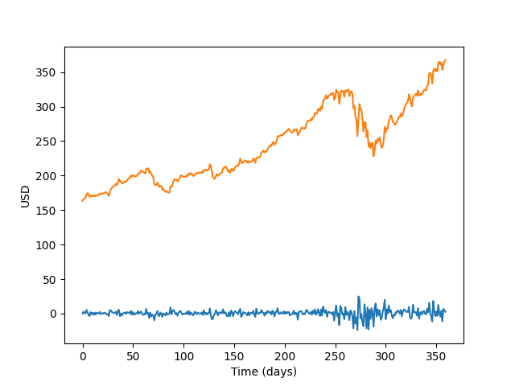

# Tradingbot


This project is a bot that automatically operates in the US Stocks Market to make profit. Created with Python and [Alpaca paper-trading](https://alpaca.markets/).

My goal as a developer with this project is to learn more about applied mathematics to financial systems. Please note, this repo is still under development, thus some bugs might exists and it is not completely functional yet.

## Instalation

For installation of this project, you should have installed Python 3.8+ and the project requirements:

```bash
$ pip3 install -i requirements.txt
```

Done? Good to go ! :)

## Usage

The bot connects to Alpaca paper-trading API, thus it must be provided with an API-KEY and an API-SECRET-KEY, which are unique for each user. Also, you should provide an URL-ENDPOINT for connection, all these data is available on the paper-trading dashboard at [Alpaca](https://alpaca.markets/) website.
You must change the following line on `tradingbot.py`, in StocksAPI class, and replace the fields with the keys provided by Alpaca:

```python
self.api = tradeapi.REST('API-KEY', 'API-SECRET-KEY', 'URL-ENDPOINT')
```

Now, just run the code

```
$ python3 tradingbot.py
```



## License

MIT license
